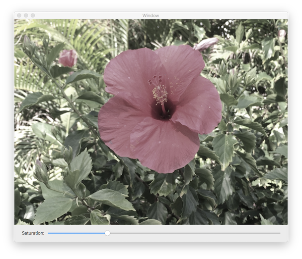

## Converting chroma-subsampled images 

 
 
 

An adaptation of Apple's article posted at the link below.

This demo is based on the vImage functions available on older versions of macOS. Certain vImage_Buffer functions were introduced in MacOS 10.10.x. Others are much earlier at macOS 10.4.x.

 
 

**Saturation at 0.25**

 
 

## Development Plaftorm
 
 

XCode 8.3.2, Swift 3.0
 
 

Deployment target is set at macOS 10.12.x

 
 

**Weblinks:**

 
 
https://developer.apple.com/documentation/accelerate/conversion/converting_chroma-subsampled_images
